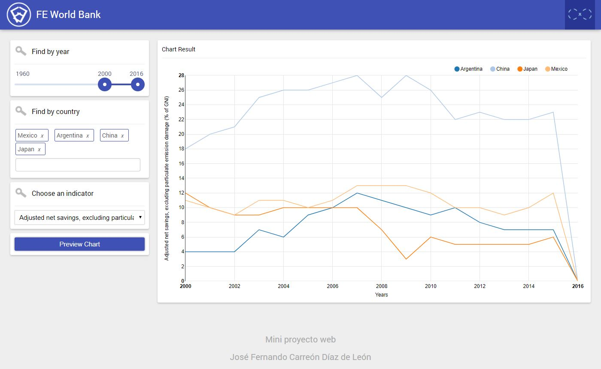

# Description

This web application allows to visualizing and interacting with the financial information from a dataset. I've used Spring framework on the back-end and AngularJS like a framework on front-end and D3 like a charting library.

# Instalation & usage
1. Download economic.rar from the root folder.
2. Create a database in MySQL called "economic".
3. Import the SQL File into import section.
4. Create or update a user with "root" name (don't worry about password. You don't need it).
5. Clone the source and open the project in Spring Tool Suite.
6. Update maven project dependencies.
7. Run the Application class located into src/main/java/economico/Application.java as Spring Boot App.
8. Run the index.html file located into src/main/webapp/index.html like a "Run on server" through Pivotal tc Server Developer Edition v3.2.
9. Test the web application.

